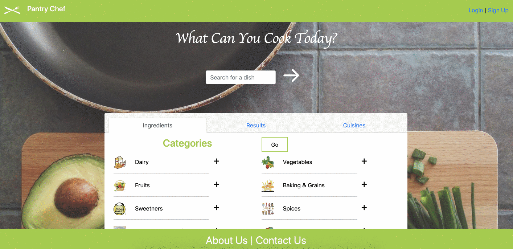

# PANTRY CHEF

## About
Web app designed to help you find recipes based on ingredients currently have at home.

 

## Click **[here](https://pantry-chef-kenny.herokuapp.com/)** to visit the Pantry Chef website!

 

## Table of Content
* [User Story](#user-story)
* [Usage](#usage)
* [Credits](#credits)
* [License](#license)

 

## User Story
As a user, I want to look up recipes to cook with ingredients that are immediately available to me at home so that I can limit going to the groceries store and risk being exposed to Coronavirus.

 

## Usage

Search: 
 
 

 

## Credits
`GitHub` | Name 

`kennyqng` | Kenny Nguyen 
`EvanDobalian` | Evan Dobalian 
`schaudhary4657` | Sapana Chaudhary 
`domenikos5` | Dominador de la Cruz 

 

## License

MIT License

Copyright (c) [2020] [Kenny Nguyen, Lauren Garelick, Rogelio Salgado, Dominador de la Cruz]

Permission is hereby granted, free of charge, to any person obtaining a copy
of this software and associated documentation files (the "Software"), to deal
in the Software without restriction, including without limitation the rights
to use, copy, modify, merge, publish, distribute, sublicense, and/or sell
copies of the Software, and to permit persons to whom the Software is
furnished to do so, subject to the following conditions:

The above copyright notice and this permission notice shall be included in all
copies or substantial portions of the Software.

THE SOFTWARE IS PROVIDED "AS IS", WITHOUT WARRANTY OF ANY KIND, EXPRESS OR
IMPLIED, INCLUDING BUT NOT LIMITED TO THE WARRANTIES OF MERCHANTABILITY,
FITNESS FOR A PARTICULAR PURPOSE AND NONINFRINGEMENT. IN NO EVENT SHALL THE
AUTHORS OR COPYRIGHT HOLDERS BE LIABLE FOR ANY CLAIM, DAMAGES OR OTHER
LIABILITY, WHETHER IN AN ACTION OF CONTRACT, TORT OR OTHERWISE, ARISING FROM,
OUT OF OR IN CONNECTION WITH THE SOFTWARE OR THE USE OR OTHER DEALINGS IN THE
SOFTWARE.